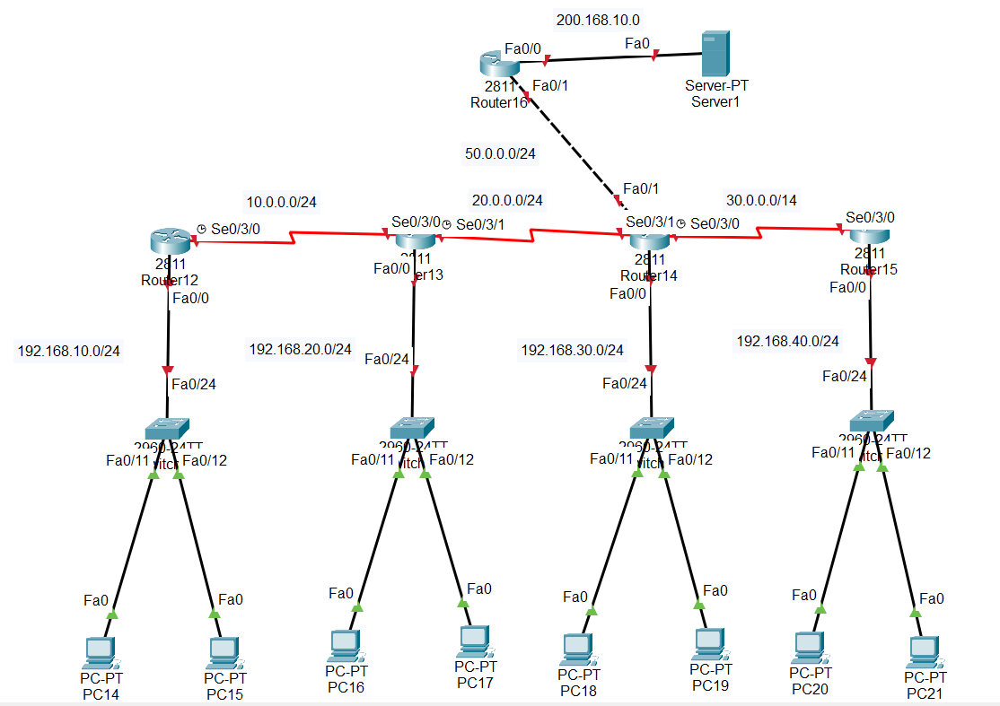

# Implementacion OSPF

Dada la siguiente topología, implementar OSPF para conectar el sistema.



## AREA 1

### R-Izquierda

```pkt
- Router(config)#int fa0/0
- Router(config-if)#ip address 192.168.10.1 255.255.255.0
- Router(config-if)#no shut

- Router(config)#int se0/3/0
- Router(config-if)#ip address 10.10.10.1 255.255.255.0
- Router(config-if)#clock rate 64000
- Router(config-if)#no shut

- Router(config)#router opsf 1
- Router(config-router)#network 10.10.10.0 0.0.0.255 area 1
- Router(config-router)#network 192.168.10.0 0.0.0.255 area 1
```

### R-Derecha

```pkt
- Router(config)#int fa0/0
- Router(config-if)#ip address 192.168.20.1 255.255.255.0
- Router(config-if)#no shut

- Router(config)#int se0/3/0
- Router(config-if)#ip address 10.10.10.2 255.255.255.0
- Router(config-if)#no shut

- Router(config)#int se0/3/1
- Router(config-if)#ip address 20.20.20.1 255.255.255.0
- Router(config-if)#clock rate 64000
- Router(config-if)#no shut

- Router(config)#router opsf 1
- Router(config-router)#network 20.20.20.0 0.0.0.255 area 0
- Router(config-router)#network 10.10.10.0 0.0.0.255 area 0
- Router(config-router)#network 192.168.20.0 0.0.0.255 area 1
```

## AREA 0

### R-Izquierda

```pkt
- Router(config)#int fa0/0
- Router(config-if)#ip address 192.168.30.1 255.255.255.0
- Router(config-if)#no shut

- Router(config)#int se0/3/0
- Router(config-if)#ip address 30.30.30.1 255.255.255.0
- Router(config-if)#clock rate 64000
- Router(config-if)#no shut

- Router(config)#int se0/3/1
- Router(config-if)#ip address 20.20.20.2 255.255.255.0
- Router(config-if)#no shut

- Router(config)#router opsf 1
- Router(config-router)#network 20.20.20.0 0.0.0.255 area 0
- Router(config-router)#network 30.30.30.0 0.0.0.255 area 0
- Router(config-router)#network 192.168.30.0 0.0.0.255 area 0
```

### R-Derecha

```pkt
- Router(config)#int fa0/0
- Router(config-if)#ip address 192.168.40.1 255.255.255.0
- Router(config-if)#no shut

- Router(config)#int se0/3/0
- Router(config-if)#ip address 30.30.30.2 255.255.255.0
- Router(config-if)#no shut

- Router(config)#int se0/3/1
- Router(config-if)#ip address 40.40.40.1 255.255.255.0
- Router(config-if)#clock rate 64000
- Router(config-if)#no shut

- Router(config)#router opsf 1
- Router(config-router)#network 40.40.40.0 0.0.0.255 area 0
- Router(config-router)#network 30.30.30.0 0.0.0.255 area 0
- Router(config-router)#network 192.168.40.0 0.0.0.255 area 0
```
